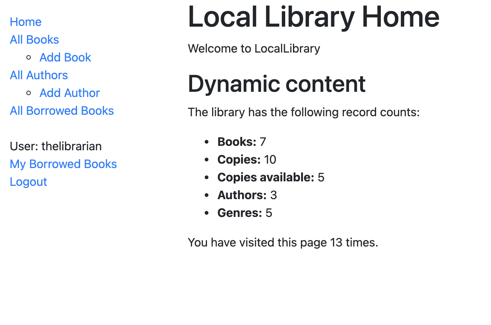

# My LocalLibrary Django App

## Created by Kassie Bradshaw

## *November - December, 2021*

---

## Overview

Following these [tutorials](https://developer.mozilla.org/en-US/docs/Learn/Server-side/Django), I have created a LocalLibrary application. Currently it isn't hosted, but that's the next step.

* Anyone can see all the books and authors the library currently has in their catalog, regardless of if the user is logged into an account.

* Each logged-in user can also see their own individual "Borrowed Books"

* Authorized users (aka Librarians) are also able to add/update/delete books and authors, as well as see all the books currently being borrowed and have the ability to renew books up to 4 weeks in the future.

